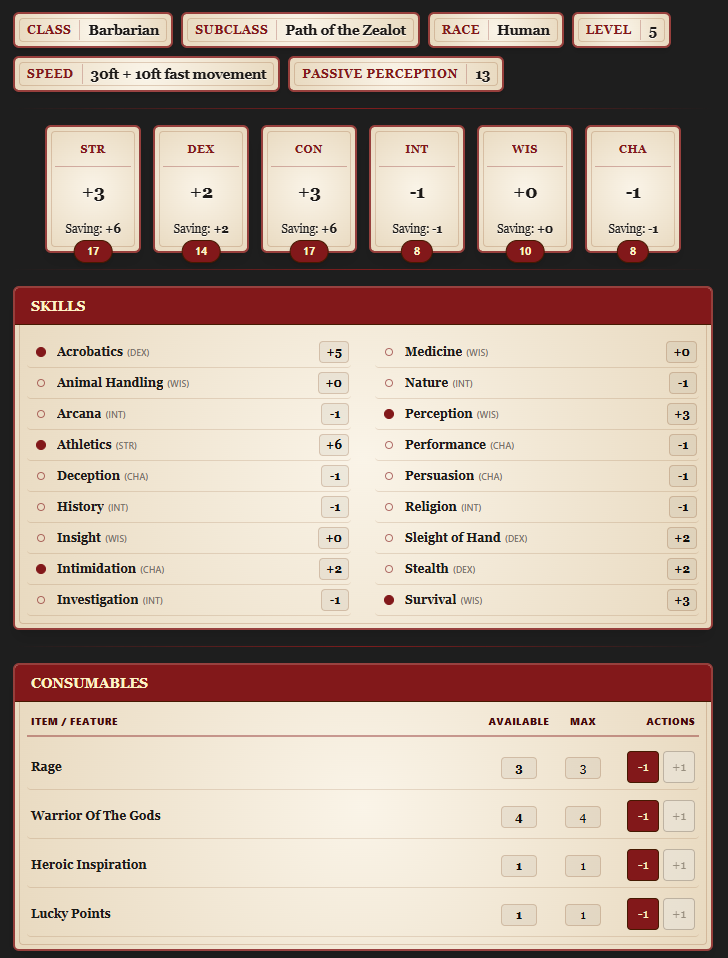
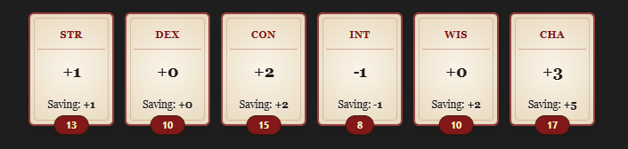
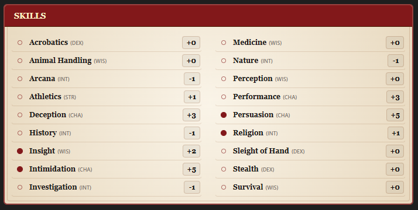
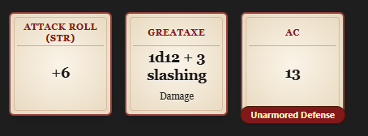
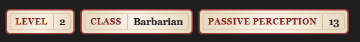
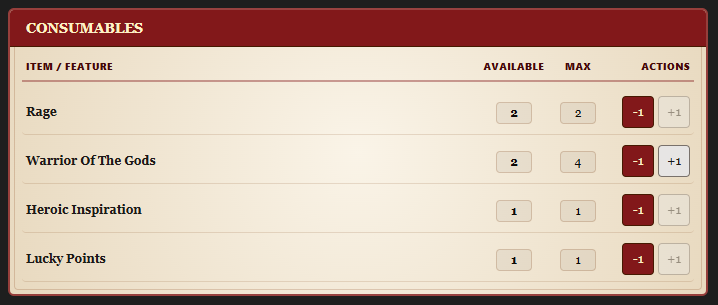

# DnD Obelisk Stats

This is a plugin used mainly to display character stats for DnD.
Why 'obelisk'? Because that was what I and my party were playing whilst developing this plugin.



# Installation

The plugin has not been submitted to the Obsidian plugin repository, so we have to do things in a different way.

1. You'll have to install [BRAT Plugin](https://community.obsidian.md/plugins/obsidian42-brat)
	* The BRAT plugin allows you to install other 'beta' plugins from git repositories directly.
2. Open the Command Palette (or click the BRAT icon on the left sidebar) and choose to "Add a beta plugin for testing (with or without version)"
3. Enter this git repository URL: `https://github.com/UltraWelfare/DnD-Obelisk-Stats`
4. Select the latest version from the dropdown menu.
5. Make sure "Enable after installing the plugin" is checked.
6. Click `Add Plugin`

# How it works

If you just want to see the markdown in action and skip the manual (although you should RTFM), check the examples folder in this repository.

## The Character Stats Data Block

First you define a ````dnd-character-stats```` markdown block. This won't render anything (except a small "Edit stats"
button) but
is instead used to "hold" the information about your character. This block is also used to store / persist data about the character.

In the simplest form you have `health.hp` (current hp) and `health.hpMax` (maximum hp). Everytime you use the HP Tracker to "take damage" or "heal" this codeblock updates with the new `health.hp` yaml value.

The bare minimum for the UI components to work is as such:

````yaml
```dnd-character-stats
pb: 3
health:
  hitDiceMax: 5
  hitDiceUsed: 0
  hp: 42
  hitDie: d12
  hpMax: 42
  tempHp: 0
abilities:
  str: 17
  dex: 14
  con: 17
  int: 8
  wis: 10
  cha: 8
savingThrows:
  - str
  - con
skills:
  perception: proficient
  survival: proficient
  athletics: proficient
  acrobatics:
    type: proficient
    bonus: 2
```
````

| Field Path               | Type             | Example                                                     | Description                                                                                                                               |
|:-------------------------|:-----------------|:------------------------------------------------------------|:------------------------------------------------------------------------------------------------------------------------------------------|
| **`pb`**                 | Number           | `3`                                                         | **Proficiency Bonus**                                                                                                                     |
| **`health.hpMax`**       | Number           | `42`                                                        | **Maximum HP**                                                                                                                            |
| **`health.hp`**          | Number           | `42`                                                        | **Current HP**                                                                                                                            |
| **`health.tempHp`**      | Number           | `0`                                                         | **Temporary HP**                                                                                                                          |
| **`health.hitDie`**      | String           | `d6`, `d8`, `d10`, `d12`                                    | **Hit Die Type**                                                                                                                          |
| **`health.hitDiceMax`**  | Number           | `5`                                                         | **Max Hit Dice**                                                                                                                          |
| **`abilities.str`**      | Number           | `1` to `20` (e.g., `17`)                                    | **Strength Score**                                                                                                                        |
| **`abilities.dex`**      | Number           | `1` to `20` (e.g., `14`)                                    | **Dexterity Score**                                                                                                                       |
| **`abilities.con`**      | Number           | `1` to `20` (e.g., `17`)                                    | **Constitution Score**                                                                                                                    |
| **`abilities.int`**      | Number           | `1` to `20` (e.g., `8`)                                     | **Intelligence Score**                                                                                                                    |
| **`abilities.wis`**      | Number           | `1` to `20` (e.g., `10`)                                    | **Wisdom Score**                                                                                                                          |
| **`abilities.cha`**      | Number           | `1` to `20` (e.g., `8`)                                     | **Charisma Score**                                                                                                                        |
| **`savingThrows`**       | List of Strings  | `str`, `dex`, `con`, `int`, `wis`, `cha`                    | **Saving Throw Proficiencies**                                                                                                            |
| **`skills.<skillName>`** | String or Object | `proficient`, `expertise`, `{ type: proficient, bonus: 2 }` | **Skill Proficiency** — string (`normal`, `proficient`, `expertise`) or object with `type` and optional `bonus` (added to final modifier) |

### Consumables

In the same stat block you can also define consumables such as:

```yaml
# ... previous dnd character stat block ...
consumables:
  consumable1:
    label: Consumable 1
    uses: 0
    usesMax: 4
    replenishesOn:
      - type: shortRest
        amount: 1
      - type: longRest
  consumable2:
    label: Consumable 2
    uses: 0
    usesMax: 3
    replenishesOn: [ shortRest, longRest ]
  consumable3:
    label: Consumable 3
    uses: 0
    usesMax: 1
    replenishesOn: longRest
```

| Field Path                           | Type                         | Example                       | Description                                                                                                                                      |
|:-------------------------------------|:-----------------------------|:------------------------------|:-------------------------------------------------------------------------------------------------------------------------------------------------|
| **`consumables`**                    | Key-Value Map                | Map of IDs                    | Root object containing custom tracking for limited-use resources, abilities, or items.                                                           |
| **`consumables.<id>`**               | Object                       | `consumable1`                 | A unique string identifier for the consumable item or resource.                                                                                  |
| **`consumables.<id>.label`**         | String                       | `"Consumable 1"`              | The name displayed in the UI.                                                                                                                    |
| **`consumables.<id>.uses`**          | Number                       | `3`                           | The current number of uses.                                                                                                                      |
| **`consumables.<id>.usesMax`**       | Number                       | `4`                           | The maximum capacity.                                                                                                                            |
| **`consumables.<id>.replenishesOn`** | String, List, or Object List | See sub-fields below          | Triggers that restore charges.                                                                                                                   |
| *— String Format*                    | String                       | `longRest`                    | Restores all charges on the specified rest type (`shortRest` or `longRest`).                                                                     |
| *— List Format*                      | List of Strings              | `[shortRest, longRest]`       | Restores all charges on any rest type included in the array.                                                                                     |
| *— Structured Format*                | List of Objects              | `- type: longRest, amount: 2` | Fine-grained recovery rules where `type` sets the rest event and `amount` sets how many charges are restored (omitting `amount` fully restores). |

### Character Sheet Examples
There's some you can check out in the [examples](examples) folder.

### User Defined Variables

You can set any variable in the same YAML. This way you can use it later to evaluate expressions. See more about
[Expressions](#expressions) 

# UI Components

## HP Tracker

To show the UI for the HP tracker alongside Long Rest / Short Rest buttons use the following markdown block:

See [Character Stats Data Block](#the-character-stats-data-block) for configuration (setting max health, hit dice etc...)

````
```dnd-hp-tracker
```
````


## Ability Scores and Modifiers

To show the UI for the Ability Scores / Modifiers / Saving Throws (
see [Character Stats Data Block](#the-character-stats-data-block) for configuration) use the following markdown block:

````
```dnd-ability-scores
```
````



### Adding Ability Notes

You can optionally add a note to each of your abilities.
For example;

````yaml
```dnd-ability-scores
str: "If you are enraged: +1"
```
````

When you add a note to an ability, the ability card will show a small asterisk on the top right. Upon clicking the
card it will open up a small modal with the note.

## Skills Table

To show the UI for the Skills use the following markdown block:

````
```dnd-skills
```
````



## Cards

Cards are a way to show additional information about your character.

To show the UI for the Cards use the following markdown block:

````yaml
```dnd-cards
perRowDesktop: 5
perRowMobile: 2
cards:
  - label: Attack Roll (STR)
    value: '{{ format(abilities.str.modifier + pb) }}'
  - label: Greataxe
    value: '1d12 + {{ abilities.str.modifier }} slashing'
    sublabel: Damage
  - label: AC
    value: '{{ 10 + abilities.wis.modifier + abilities.con.modifier }}'
    offlabel: Unarmored Defense
```
````



For more information on the expressions see [Expressions](#expressions)

| Field Path             | Type (* = required) | Example                                          | Description                                                                                                        |
|:-----------------------|:--------------------|:-------------------------------------------------|:-------------------------------------------------------------------------------------------------------------------|
| **`perRow`**           | Number              | `4`                                              | Number of cards displayed per row on both desktop and mobile screens. (or use the ones below for more granularity) | 
| **`perRowDesktop`**    | Number              | `5`                                              | Number of cards displayed per row on desktop screens.                                                              |
| **`perRowMobile`**     | Number              | `2`                                              | Number of cards displayed per row on mobile screens.                                                               |
| **`cards`**            | List of Objects     | List of card configurations                      | Array of individual card definitions to render.                                                                    |
| **`cards[].label`**    | String *            | `"Attack Roll (STR)"`                            | Primary title displayed at the top of the card.                                                                    |
| **`cards[].value`**    | String *            | `'1d12 + {{ abilities.str.modifier }} slashing'` | Text or dynamic template string rendered as the main card content.                                                 |
| **`cards[].sublabel`** | String              | `"Versatile"`                                    | Secondary subtitle text shown below main label.                                                                    |
| **`cards[].offlabel`** | String              | `"+2 to hit"`                                    | Small badge text                                                                                                   |

## Badges

Badges are similar to cards except rendered horizontal and smaller (like a ... badge :D).

To show the UI for the badges use the following markdown block:

````yaml
```dnd-badges
badges:
  - label: Level
    value: '{{ level }}'
  - label: Class
    value: '{{ class }}'
  - label: Passive Perception
    value: '{{ 10 + skills.perception.modifier }}'
```
````



| Field Path           | Type (* = required) | Example                                   | Description                                                    |
|:---------------------|:--------------------|:------------------------------------------|:---------------------------------------------------------------|
| **`badges`**         | List of Objects     | List of card configurations               | Array of individual badge definitions to render.               |
| **`badges[].label`** | String *            | `"Passive Perception"`                    | The main label rendered on the start of the badge.             |
| **`badges[].value`** | String *            | `'{{ 10 + skills.perception.modifier }}'` | Text or dynamic template string rendered as the badge content. |

For more information on the expressions see [Expressions](#expressions)

## Consumables

To show the UI for the consumables (see [Consumables](#consumables) for configuration) use the following markdown block:

````yaml
```dnd-consumables
```
````

The default behavior is to hide consumables with zero max uses. You can optionally change this by setting `hideZeroMaxUses: false` inside the dnd-consumables block.



## Buttons

Use a `dnd-buttons` block to create actions that update variables in the
`dnd-character-stats` block:

````yaml
```dnd-buttons
buttons:
  - label: Spend rage ({{ consumables.rage.uses }} left)
    variant: red
    update:
      consumables.rage.uses: "{{ math.max(0, consumables.rage.uses - 1) }}"
```
````

Each button requires a `label` and an `update` map. The update keys are
dot-separated variable paths. Values may be YAML values or expressions (see [Expressions](#expressions)), and
multiple updates on one button are saved together. Optional `variant` values
are `neutral`, `green`, and `red`; optional `size` values are `small`, `medium`,
and `large`.

# Expressions

Expressions are used to render dynamic content in the UI. They are written using JavaScript.

## Where can I use them?

You can use them inside the character stat block as well as cards, badges blocks.

Note: For the character stat block the "parser" will parse top-to-bottom, which means to use a variable in an expression
it, it has to be defined beforehand.
For example;

Valid:

```yaml
level: 5
someRandomCalculation: "{{ level + 10 * 4 }}"
```

Invalid:

```yaml
someRandomCalculation: "{{ level + 10 }}" # level is not available yet
level: 5
```

### What can I access?

You can generally access the whole `dnd-stat-character` input. Simple examples:

* `"{{ health.hp + 20 }} }}"`
* `"Your proficiency bonus is: {{ pb }} !!"`

See the [character stat field table reference](#the-character-stats-data-block).

Any other variable you set yourself can be accessed in the same way. (Note: `math` is reserved as a name, see [Implemented Functions](#implemented-functions))

There is an exception on how **abilities** and **skills** are being accessed. 

For abilities instead of `{{ abilities.str }}` you have three separate subfields.
The raw `score`, the calculated modifier `modifier` and for the saving throw modifier `savingThrowModifier`

| Field Paths                                |
|--------------------------------------------|
| **`abilities.<stat>.score`**               |
| **`abilities.<stat>.modifier`**            |
| **`abilities.<stat>.savingThrowModifier`** |

For skills instead of `{{ skills.perception }}` you have two separate subfields.
There is `bonus` ('normal' or 'proficient' or 'expertise') and a `modifier` (which is the calculated modifier)

| Field Paths                   |
|-------------------------------|
| **`skills.<skill>.bonus`**    |
| **`skills.<skill>.modifier`** |

## Examples in Character Stat block

### Deriving Hit Dice from levels

Instead of manually writing out how many hit dice the character has, you can evaluate to a `level` variable.

````yaml
```dnd-character-stats
pb: 2
level: 3
health:
  # ... others ...
  hitDiceMax: "{{ level }}"
  # ... others ...
```
````

### Deriving max consumable uses.

Consider a feat called that makes you teleport, and it's only allowed pb / 2 (rounding down) per long rest. You can set
up a consumable like:

````yaml
```dnd-character-stats
# ... previous stats
consumables:
  teleport:
    label: Teleport
    uses: 0
    usesMax: "{{ math.floor(pb / 2) }}"
    replenishesOn: longRest
```
````

### Calculating variables based on the characters level to be used later

On barbarian, the class has a different `Rage Damage` based on his level. You can set up your own variable to later
display it:

````yaml
```dnd-character-stats
# ... previous stats
barbarian:
  rageDamagePerLevel:
    "1": 2
    "2": 2
    "3": 3
    "4": 3
    "5": 3
    # fill the rest
  rageDamage: "{{ barbarian.rageDamagePerLevel[level] }}"
```
````

We've essentially set up a variable that is a table where the key is the level and the value is the rage damage. Then we
can use the `level` variable to look up the rage damage for the current level.
Later on in a card we can display this damage:

````yaml
```dnd-cards
cards:
  - label: Rage Damage
    value: "{{ barbarian.rageDamage }}"
```
````

(You could also not have the `barbarian.rageDamage` variable at all, and do the calculation right in the card).

### Implemented functions


* `math.floor` rounds down (using Math.floor)
  * example: `"{{ math.floor(pb / 2) + level }}"`
* `math.format` shows a "plus" or a "negative" sign
  * example: `"{{ math.format(barbarian.rageDamage) }}"` (will either show +3 or -3)
* `math.mod` calculates a modifier given a score.
* `math.min`
* `math.max`
### Expression constructs

* Values: numbers, strings, booleans, null, undefined, and arrays
* Variables
* Property access: character.name
* Optional access: character?.name
* Function and method calls: `math.floor(value)`, `math.format(value)` (see [Functions](#implemented-functions))
* Arithmetic: +, -, *, /, %, **
* Comparisons: <, <=, >, >=, ==, !=, ===, !==
* Logic: &&, ||, ??, !
* Conditions: condition ? valueA : valueB
* Unary operators: +, -, !, ~

### Concatenation

Adding strings in between is also possible:
````yaml
```dnd-badges
badges:
  - label: Test 
    value: "Your level is {{ level }} and your PB is {{ pb }} !!"
```
````

### Security Concerns
The expressions are first parsed using [Acorn](https://github.com/acornjs/acorn) and then evaluated using a custom parser.
I've mostly taken care of the usual suspects (prototype injections, accessing constructors, etc.) but I can't guarantee that it's 100% safe.

If you're writing the expressions yourself, you shouldn't have to worry about anything.

Most of the language features have been stripped out, leaving only the basic stuff for expression evaluation.

I repeat, do not trust code given online (always double-check that it doesn't do anything weird). 

I do not take any responsibilities:)

# F.A.Q

## Why use this plugin?

The main issues I wanted to address when developing this plugin for my party was:
* A way to save the information (hp, consumable uses) inside the Note (markdown file) itself instead of relying on .json data
  * Our specific burden was `obsidian-livesync`. Syncing plugin data has a lot of rough edges.
* A more configurable system
  * See the example of "Barbarian Rage Damage". You automate this once with expressions, and you never look at it back again. You can go as far as automating spell slots as well (There's an example of this in the folder `examples`).
  * No "constraints" around what you define – everything can be user-defined.
* Data locality
  * Most other plugins (that we've tried as a party) each specify their data on their own markdown block. I prefer to have the data all in one place (in one markdown block) and derive from there.

It may not be for everyone – but since I've made it for my party, why not open-source it?

## I use the markdown blocks and nothing shows up!

Make sure the YAML is in the correct format. Do not use tabs but use spaces instead (two spaces per indentation level).

In the future I want to add to show more errors when something goes wrong.

## I still need help!

You can either make an issue or you'll find me on [Obsidian TTRPG Community Discord](https://obsidianttrpgtutorials.com/Obsidian+TTRPG+Tutorials/Obsidian+TTRPG+Tutorials) under the same username `UltraWelfare`.

## Can you make this agnostic (work with other systems) ?

I'd love to try that as a challenge, but I'm not familiar with more ttrpg systems, so it's not 100% clear to me on how to make it agnostic. The other issue is life ™.


# LLM - AI Disclosure

The code was mostly written the traditional way, and LLMs - AI was only used as a code-assist / search engine. The pieces of code that were 
generated (although I still made changes by hand) were the React (UI) components as I'm not the best with frontend styling :)
